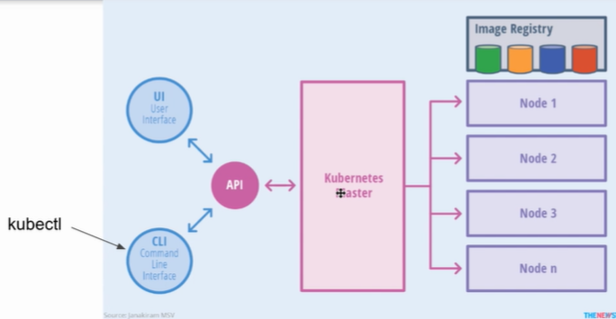

# kubectl基礎

### 流程圖

### 命令

 `source <(kubectl completion zsh)`

 `kubectl config (子命令)`
    
ex:  `kubectl config view`  (閱覽config 情況)
文件在/.kube 的 config內 
      
      
config內clusters: 底下是創建的叢集 

### kubectl指令

 `kubectl get node` 查閱連結context內的叢集
 
 `kubectl get pods` 查閱pod內的叢集
 
 `kubectl get pods --all-namespaces` 查閱pod內的叢集
 
 `kubectl config get-contexts` 查閱contexts數
 
 `kubectl config set current-context xxxxx` 設定要連哪一個context
 
 如果要改context的名稱，先到config底下 contexts: 內 context 的name 去改，然後再重連。
 
