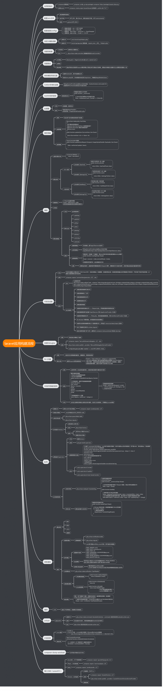

#  基礎

### 創新檔案

`composer create-project laravel/laravel  example-app`

或者
`composer global require laravel/installer`

`laravel new example-app`

### 啟動
`php artisan serve`

### 資料夾結構

資料夾名稱	說明 :

- app	開發程式的地方，裡面有Controller、Exceptions… 待會再詳細說明
- bootstrap	啟動laravel的地方，基本的開發不會改動到這區塊
- config	設置系統參數的地方，可以定義一些文字或變數，供程式使用，改變參數就不需要改程式
- database	存放DB的scheme與設定假資料的地方
- public	web的進入點，圖檔、js、css、編譯過的檔案都會放在這裡
- resources	前台資源的地方，編譯前的js、scss、語言檔、views
- router	路由參數，設置url對應controller的地方
- storage	存放編譯過的blade、logs、暫存檔的地方，基本的開發不會改動到這區塊
- tests	撰寫測試程式的地方
- vendor	package的目錄，與node_modules的用途一樣
檔案	說明
- .env .env.example	系統參數的檔案
- composer.json .lock	Laravel版本、已安裝的package，一些composer的設定， .lock則是編譯過後的.json檔，供部署或其他開發者，安裝相同版本的package
- package(-lock).json	用npm管理js套件的地方，用途跟composer相似
- phpunit.xml	設定php unit test的檔案
- server.php	模擬一個apache或nginx的設定，可以快速建立一個測試環境來執行laravel
- webpack.mix.js	webpack打包js、scss的設定檔，需要搭配node和npm服用

app資料夾	說明 :

- Console	可以用來撰寫atrisan指令與排成指令
- Exceptions	例外處理，可以自定錯誤文字或者錯誤後該做什麼動作的地方，預設會將exception向上丟出(如果.env設置debug=true時就會呈現在畫面中)也會把錯誤記錄到log中
- Http	撰寫Controller、Middleware的地方，預設會給一套登入/註冊系統的Controller，Middelware則有常見的是否已登入、Cookie加密、CSRF白名單…等的判斷
- Providers	提供自訂provider的地方，laravel啟動時會載入許多providers來建置整個系統，providers的清單在config/app.php中，官方文件是說大部分的providers都是緩載入的情況，當被使用時才會真實載入
- User.php	是一個Eloquent ORM的Model，可以操作預設的users資料表

未載入資料夾 :

- Broadcasting	顧名思義是指廣播系統，也就是跟webSocket有關係，可以讓後端程式發訊息到前端的socket，可以搭配Laravel Echo、Pusher來使用
- Events	定義事件的地方，可以說是 當…時，通常會配合listener使用
- Listeners	定義一些邏輯被觸發執行，也就是當event時做…，跟隨著event發生時做某件事情
- Mail	建置與封裝跟mail有關的程式邏輯
- Notifications	可以設定當系統觸發什麼事件就發送一個簡單的通知，官方舉例：寄mail、Slack…等
- Policies	可以寫條件規則，限制使用者的操作，可搭配Gate使用，讓router受到條件限制使用
- Http\Requests(Rules)	撰寫Form Validation的規則，讓post進來的變數只留下有定義的，也可以透過 http method 增減驗證規則

### 套件結構

