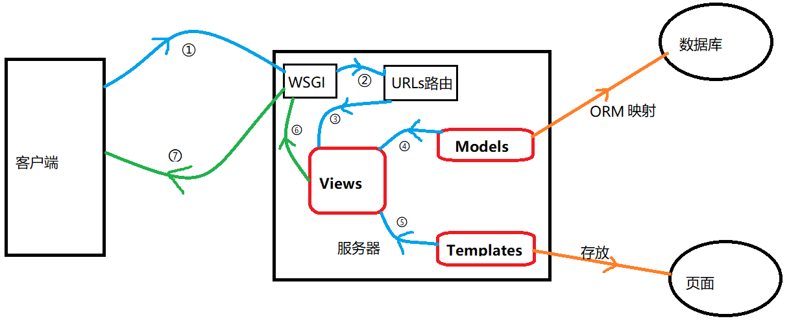

# 基本架構

### 官方文件

-官方文件  https://docs.djangoproject.com/zh-hans/3.1/topics/

### 架構流程圖



### MVT設計模式

     M（Models）：資料模型，直接對映到資料庫

     V（Views）：功能檢視，編寫你的業務功能

     T（Templates）：頁面模板，就是顯示在瀏覽器的 HTML 檔案


### 目錄結構 :

```
projectname
|  manage.py
|
└───djangoAPI
          asgi.py
          settings.py
          urls.py
          wsgi.py
          __init__.py

```
- manage.py: django命令包 參考
- asgi.py: ASGI兼容的Web服務器上的入口
- settings.py: 項目配置文件(DB、金鑰、引用apps...)
- urls.py: 主要路由器(各功能urls可於此集中)
- wsgi.py: WSGI兼容的Web服務器上的入口
- __init__.py: 一個空文件，告訴python這個目錄是一個python包 參考

### 創建應用模組:

   `python manage.py startapp <功能名稱>`
   
```
  |   manage.py
  \---testSetting
      |   admin.py
      |   apps.py
      |   models.py
      |   tests.py
      |   views.py
      |   __init__.py
      |   urls.py(自行定義)
      |
      \---migrations
              __init__.py
 ```            
- admin.py: 管理員設置
- migrations: 資料庫創建紀錄
- models.py: 資料庫模型
- views.py: 功能邏輯
- urls.py: 該功能路由   

之後把開新應用的檔案夾名稱，到主要專案的`settings.py` 裡新增

         INSTALLED_APPS=[
         '<功能名稱>'
         ]
### 新增Model
   
   在應用裡面有`models.py`
   
   裡面增加model.
   
   ex: 
    
    class Stock(models.Model):
          category = CharField(max_length=50,blank=True,null=true)
          ...

### 新增 migrations 
 新增makemigrations 表格  `python manage.py makemigrations`

`python manage.py migrate`


###  admin

/admin 為預設網站管理者介面

在應用程式的`admin.py`裡面

它會跟為Model裡的 加入:

     from django.contrib import admin

     # Register your models here.
     from .models import ModelClass

     admin.site.register(ModelClass)

它會新增Model的分類面板

在進入admin之前必須使用login登入


可以新增 superuser
`python manage.py createsuperuser`

修改 superuser 密碼
`python manage.py changepassword <帳號>`

可以到shell底下修改:

`python manage.py shell`

     def reset_password(u, password):
         try:
             user = get_user_model().objects.get(username=u)
         except:
             return "User could not be found"
         user.set_password(password)
         user.save()
         return "Password has been changed successfully"
