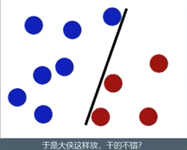
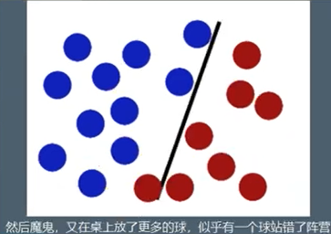
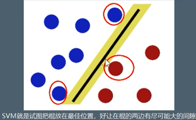
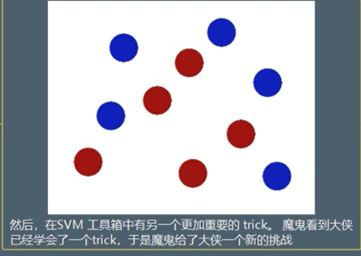
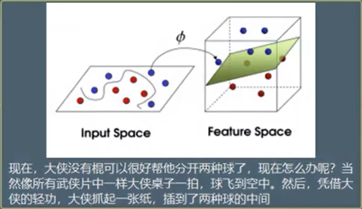
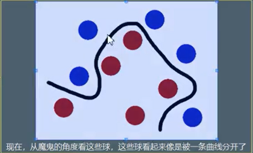
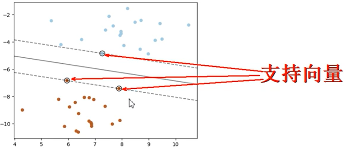
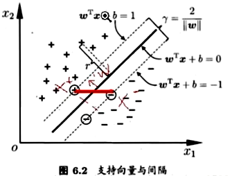
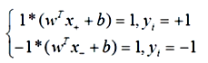
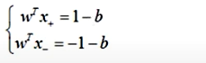

# SVM講解

SVM (Support Vector Machine) 向量分類器 

- 向量機

- 主要針對小樣本數據

- 非線性

- 高為模式識別 

簡單例子:

  1.將下列分類

  2.以下不一定好

  3.找到分際線附近的點
 

複雜例子:

  1.將下列分類

  2.將二維變成高維 ，因為屬性不同， 高度也就不同

  3.平面看到的樣子
 

- SVM 分切3D圖 https://www.youtube.com/watch?v=OdlNM96sHio

   名詞: 
   
   1.球 等於data
   
   2.棍子 等於classifier
   
   3.最大間隙trick  叫做 optimization

   4.拍桌子叫 Kernelling

   5.那張紙叫 hyperplane 

   
### 支持向量

  靠近線的點為支持向量
  

- 支持向量公式 https://developer.aliyun.com/article/655112

公式:

推導出:

