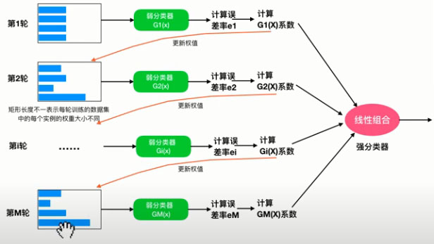

# Adaboost
 
  - 參考 https://scikit-learn.org/stable/modules/ensemble.html#adaboost
 
  - 當數據特徵不夠明顯的時候，就難以分開，所以我們就將數據放大，係數變大，類似用放大鏡看樣本。
 
  - 多棵樹組成。
  
  - AdaBoost的核心原理是擬合一些弱學習者。(僅比隨機猜測好一點的模型，例如小決策樹)，然後，通過加權多數表決（或總和）將來自所有預測的預測進行組合以產生最終預測。
  
  - 因此第一步僅需對原始數據進行訓練即可。
  
  對於每個連續的迭代，將分別修改樣本權重，並將學習算法重新應用於重新加權的數據。
  
  在給定的步驟中，那些在上一步驟中誘導的增強模型未正確預測的訓練示例的權重增加了，而對於正確預測的權重卻減小了。
  
  隨著迭代的進行，難以預測的示例受到越來越多的影響。
  
  
  
  
  
  
 
