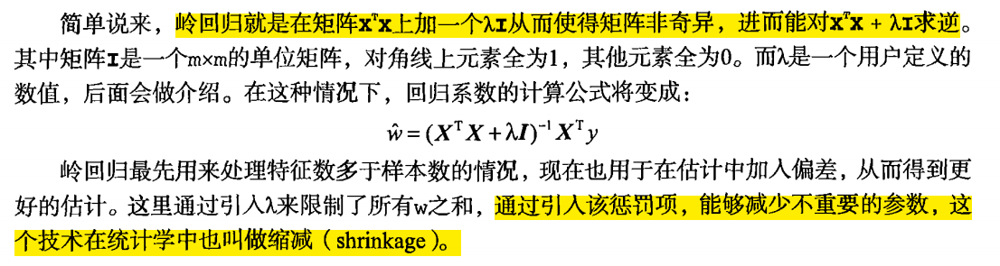

# Ridge回歸

- 對於線性回歸的一種優化。

- 回歸通過對係數的大小進行懲罰來解決普通最小二乘的一些問題。

複雜度參數α≥0控制收縮量：α值越大 ，收縮量就越大，因此係數對共線性越穩建。

目的就是讓W越小，向0靠近。

%%單位矩陣 入I

有些方程式為奇異矩陣，比如:

     x + y + z = 10
     2x+ y + z = 10
     2x+ 2y+ 2z= 20 
     
     X = np.array([[1,1,1],[2,1,1],[2,2,2]])
     np.linalg.matrix_rank(X) =>2  未滿秩
     
如果數據的特徵比樣本點還多應該怎麼辦？是否還可以使用線性回歸和之前的方法來做預測？

答案是否定的，即不能再使用前面介紹的方法。這是因為輸入數據的矩陣X不是滿秩矩陣。非滿秩矩陣在求逆時會出現問題。

為了解決這個問題，統計學家引入了嶺回歸（ridge regression)的概念

     
缩减方法可以去掉不重要的参数，因此能更好地理解数据。此外，与简单的线性回归相比，缩减法能取得更好的预测效果。 

岭回归是加了二阶正则项的最小二乘，主要适用于过拟合严重或各变量之间存在多重共线性的时候，岭回归是有bias的，这里的bias是为了让variance更小。

- `正則(re)` : Regularization (規則化)限制，不能讓係數無限大。

### 歸納總結

- 嶺回歸可以解決特徵數量比樣本量多的問題

- 嶺回歸作為一種縮減算法可以判斷哪些特徵重要或者不重要，有點類似於降維的效果

- 縮減算法可以看作是對一個模型增加偏差的同時減少方差

- 嶺回歸用於處理下面兩類問題：

  1.數據點少於變量個數

  2.變量間存在共線性（最小二乘回歸得到的係數不穩定，方差很大）

 -參考 https://www.cnblogs.com/xueyinzhe/p/7253315.html

https://www.youtube.com/watch?v=z-iTRWK9czk&list=PLwDQt7s1o9J65aQ6HYN4LaqRkX8ncKG1D&index=72&t=30m2s
