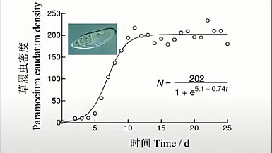
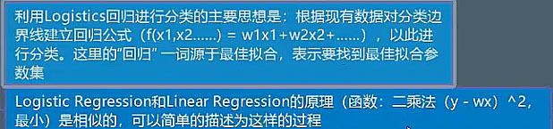
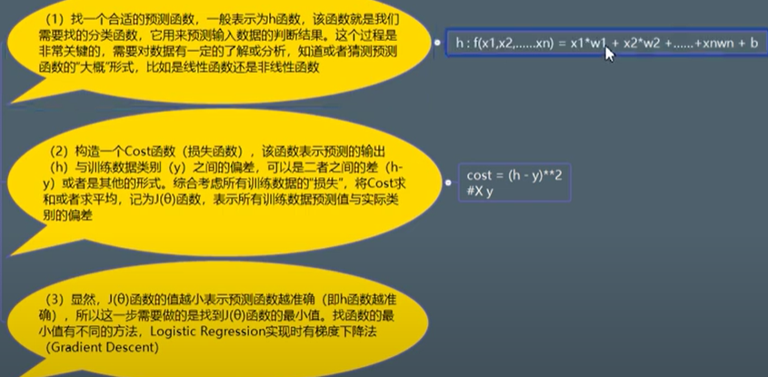

# 邏輯斯蒂回歸

### 邏輯斯蒂 函式

 

--------------------------------

- 是為了解決分類問題。
  
  所有分類問題都是概率問題。
  
- 線性回歸轉換到邏輯斯蒂函式，轉換成概率0到1之間，這樣變成分類問題。

-　流程。

https://www.youtube.com/watch?v=JqQ6MJ9r1r0&list=PLwDQt7s1o9J65aQ6HYN4LaqRkX8ncKG1D&index=78&t=10m
