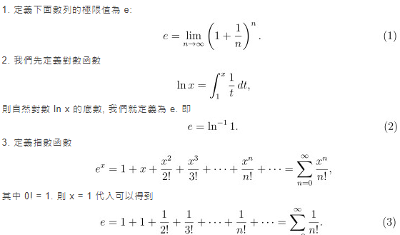

# 知識

### 計算知識

負平方:

    ex:
        2**(-3)
        => 2**(0)/2**(3)
        => 1/2**(3)
        => 1/8

自然底數 e :

   e = 2.71828182845905
   
   
   

### 機器學習分類

- 監督學習

  基本上整體過程為: 輸入特徵(input)，給定答案(output)，期望透過機器去找出兩者之間的關係(function)。

  分類(Classification) :
  
      1.目標為離散的。

      2.把資料分到我指定的幾個類別中。

      3.常見的演算法：決策樹、邏輯迴歸、SVM（支援向量機）、樸素貝葉斯、kNN

       應用領域預測常用於獲客成本較高、需要深度經營客戶關係的產業，如：

       電信、金融業。金融業也常透過分類機制去決定核貸與否、放款的金額與利率等；
       
       藉由年齡、年收入、教育程度、還款紀錄等作為變數，以預測存戶的信用評等。

       行銷或公關部門也常會藉語意分析的結果掌握輿情，其技術就是蒐集網路文章、站上評價等，
       
       經過斷字處理，再將文章做正負面的分類。其他常見應用如：垃圾郵件偵測、文章分類、語種偵測。
    
  
  迴歸(Regression) : 
  
      1.預測的目標為連續的數值。

      2.畫出一條盡量通過這些點的線。

      3.常見的演算法：線性迴歸、多項式迴歸

      應用領域如：

      股票走勢預測、不同時段的交通狀況、原物料價格變化對消費的影響…等。

      另外，自台灣電商提供 24 小時到貨服務開始，陸續引進 AI 改善進銷庫存，

      iKala 的 ML 團隊也協助電子商務導入這種銷售量預測，協助商品採購、品項管理單位做決策。
    
    

- 無監督學習
  
  1.沒有答案(output)，只有輸入特徵(input)，期望透過機器去找出樣本之間的隱含關係。

    

- 半監督學習

- 強化學習
 
 分群(clustering) :
 
 如果我們預設要分3群，則機器自動根據inputs把特徵相似的卡通人物放在一組。
 
 可以發現機器可能認為藍色那組都有"黃色鴨嘴"、"大腳丫"、"纖細的身體"，因此歸類在"鴨鴨群"
 
 
### 數學知識

# 方差(Variance)

- 參考 https://kknews.cc/zh-tw/tech/vy5ae4.html

  1.方差描述隨機變量對於數學期望的偏離程度，通常以`σ2`。

   例如 两人的5次测验成绩如下：

     X： 50，100，100，60，50，平均值E(X)=72；

     Y：73， 70，75，72，70 平均值E(Y)=72。

     平均成绩相同，但X 不稳定，对平均值的偏离大。

  2.直接计算公式分簡單平均法和加權平均法。

  3.平方的均值减去均值的平方
    
# 標準差   

1. 均方差，用`σ`表示。

2. 方差的平方根即為標準差。

# 對數(logarithm)

  1.冪運算的逆運算。

   以下的公式:
  
   

   對數則寫:

   

  2.其中B 是對數的底（也稱為基數），而 Y就是X（對於底數B）的對數。

# 導數（Derivative）

  1.一個函數在某一點的導數描述了這個函數在這一點附近的變化率。

  2.導數是函數的局部性質。

  3.不是所有的函數都有導數，一個函數也不一定在所有的點上都有導數。

  4.若某函數在某一點導數存在，則稱其在這一點可導，否則稱為不可導。

  5.一個實值函數的圖像曲線。函數在一點的導數等於它的圖像上這一點處之切線的斜率。

 

# 偏導數（Partial derivative）
  
  Marquis de Condorcet AD.1770
  
  `∂`為偏導數表示符號。偏導數反映的是函數沿坐標軸正方向的變化率。
  
  在數學中，一個多變量的函數的偏導數，就是它關於其中一個變量的導數而保持其他變量恆定（相對於全導數，在其中所有變量都允許變化）。
  
  偏導數在向量分析和微分幾何中是很有用的。
  
