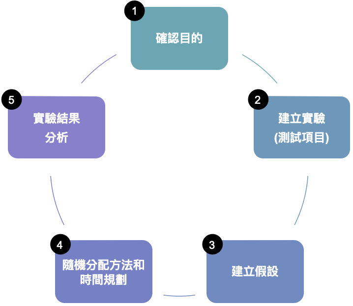
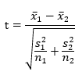
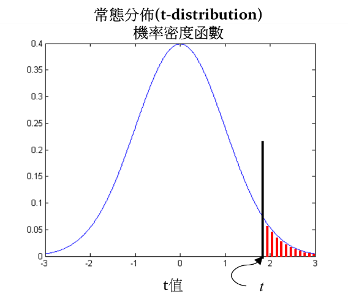
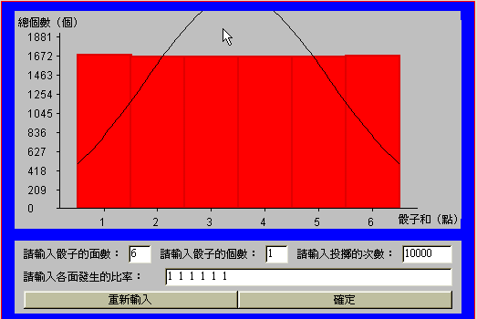
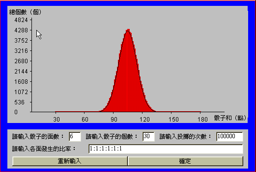

#  A/B Test

## A/B test 的 5 步驟

## 名詞定義

  -  z-score :標準分數 
  
   統計學中是一種無因次值，
    
   就是一種純數字標記，
   是藉由從單一（原始）分數中減去母體的平均值，
   
   再依照母體（母集合）的標準差分割成不同的差距，
   
   按照z值公式，各個樣本在經過轉換後，通常在正、負五到六之間不等。

   

  -  T-Value : 
     
   1. 計算兩者間的關係。
     
     
   2. 計算公式: 
     
    a.   X = 平均數。

    b.   S = 標準差。

    c.   n = 樣本數。

   
     
     
   3. t值越接近0，兩組之間越沒有差異，t值越遠離0則兩組差異越大。

  - P-Value : 
  
   1. 在分佈常態分佈下≥t值的`機率密度值(probability density value，P(x≥t))`。
     
   2. p值是下圖紅色區域的面積值(從黑色線的位置t積分到無窮大)，BTW整個分佈的面積值等於1(從負無窮大積分到無窮大)。
     
   
     

  - 自由度(df) :
    
    1. 自由度越大(基本上等於樣本數越大)。
  

-參考 

1. https://www.cupoy.com/marathon-mission/00000174C4BC1B93000000016375706F795F70726572656C656173654355/000001755460C9F5000000076375706F795F72656C656173654349/

2. https://chih-sheng-huang821.medium.com/%E7%B5%B1%E8%A8%88%E5%AD%B8-%E5%A4%A7%E5%AE%B6%E9%83%BD%E5%96%9C%E6%AD%A1%E5%95%8F%E7%9A%84%E7%B3%BB%E5%88%97-p%E5%80%BC%E6%98%AF%E4%BB%80%E9%BA%BC-2c03dbe8fddf

## 內容

- H0 稱為虛無假設 (母體參數提出一個主張，假設此主張為真實（除非能證明此主張非真！）)

- H1 稱為對立假設 對立假設是相對於虛無假設所提出的另一個不同（相反）的假設或主張，必須有足夠的證據，才能說明此主張為真。

Q0:假設你哥哥 (P) 平日都開紅色車子(Q) [P Q]你能推論出下面哪一個結果？

    若P ≧ Q是對的（成立），
    
    我們無法保證 Q ≧ P 或 -P≧ -Q  一定是對的 ，

    僅能肯定 -Q ≧ -P 的敘述也是正確的。

Q1: 吃減肥藥能在一個月內瘦超過十公斤，研究人員想推翻第四台廣告業者的說法，請試著寫出 H_0 與 H_1 ?

    H1: 吃減肥藥能在一個月內瘦"不能"超過十公斤(X<10)

    H0: 吃減肥藥能在一個月內瘦"能"超過十公斤(X>=10)
    
Q2: 一位速食店店長認為其品牌在市場之佔有率至多為12%，於是該店長進行一個市場調查，一共訪問了3000為消費者，其中有311位表示喜歡該品牌，請試著寫出 H_0 與 H_1?

    H1: 其品牌在市場之佔有率至多 12%(p<12%)
    
    H0: 其品牌在市場之佔有率超過 12%(p>=12%)

### 中央極限理論(Central Limit Theorem)

也稱為`常態收斂定理`

- 解釋 :  

  1.主要是指從平均數為 ，
  標準差為 的母體中，
  隨機地抽取大小為的獨立樣本。
  當樣本數很大時，
  其樣本平均減掉平均數
  再除以標準差，將會趨近平均數為0，標準差為1 的常態分佈(normal distribution)。
  
  
 

 
### 檢定

-參考

https://www.cupoy.com/marathon-mission/00000174C4BC1B93000000016375706F795F70726572656C656173654355/00000176E15834E90000001E6375706F795F72656C656173654349/

------------------------------------------------

根據 H1 所定訂範圍分類，可分為:

- 雙尾檢定： H0 : θ=θ0；  H1 : θ≠θ0
- 左尾檢定： H0 : θ≧θ0 ； H1 : θ<θ0
- 右尾檢定： H0 : θ≦θ0 ； H1 : θ>θ0

------------------------------------------------
根據樣本的範圍，可分為 :

- 單樣本檢定
- 雙樣本檢定
- 成對樣本
- 
------------------------------------------------
根據檢定目的，可分為 :

平均數檢定
比例檢定

## 抽樣分配

- t 分配

  1.學生t-分配(Student's t-distribution) 可簡稱為 t 分配。

  2.應用於在母體標準差(σ)未知的情況下，不論樣本數量大或小皆可應用學生 t 分配估計呈常態分布且變異數未知的總體的平均值。

  假設 X 是常態分配的隨機變數，平均數為 μ，標準差為 σ，抽出 X1,...,Xn 服從 X~N(μ,σ2)

  

  3.t 分配當樣本數越多時，自由度就會越高，從右圖模擬觀察到， t 分配當自由度為 30 時，很接近常態分配。 

  4.母體標準差通常都是未知居多，因此在假設檢定時統稱為 t 檢定，大樣本時可以採用 Z 分配方便計算。

- 卡方分配

  1.卡方分配是標準常態的變形，Z 為標準常態分配，Z 的平方為自由度為 1 的卡方分配 →`Z~N(0,1), Y = Z2, Y~X2(1)`
   
  2.卡方分配具有以下特性：
 
  
    

- F 分配

## 假設檢定的誤差類型

**α**：Type I error/型一誤差，又稱偽陽性 false positive，H0 是對的，但是我們做了實驗後，卻拒絕H0，又稱顯著水準(significant level)，設定 α 值愈小，表示希望檢測時的誤判機率愈低(即希望檢定能愈準確)

**β**：Type II error/型二誤差，又稱偽陰性 false negative，H0 是錯的，但是我們做了實驗後，卻沒有證據拒絕 H0。

**1- β**：又稱檢定力，H0 是錯的，但是我們做了實驗後拒絕 H0 的能力。

!! 若用驗孕棒為一位未懷孕的女士驗孕，結果是已懷孕(positive)，這是第一型錯誤。

!! 若用驗孕棒為一位已懷孕的女士驗孕，結果是未懷孕(negativ)，這是第二型錯誤。

檢定 H0：μ < 0，H1：μ > 0，

假設在 H0 為真下，分配為 **N(0,1)**

H1 為真下，分配為** N(2,1)**。
