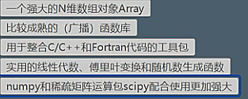

# numpy(numeric python)教學

- 中文手冊 https://www.numpy.org.cn/reference/routines/math.html

`import numpy as np`

-版本  `np.__version__`

- 矩陣:

    =>
    
      l =[1,2,3,4,5]
      type(l)
      
      nd=np.array(l)
      
      #np.array 與 python矩陣不同處就是可以用np的方法計算 
      
      
    =>
      
      np.array(0,10000,1)
      
      
    =>
    
      np.ones(shape=(5,5),dtype=np.int8)
            
    =>
    
      np.ones(shape=(5,5,4),dtype=float16) #  三維
      
    =>
    
      np.full(shape=(3,4),fill_value=3.14) #全部都是fill_value
      
    =>
    
      #對角線都是1 
     
      np.eye(N=5) #對角線都是1  
      
      exprot :[[1,0,0,0,0],  #單位矩陣
               [0,1,0,0,0], 
               [0,0,1,0,0],
               [0,0,0,1,0],
               [0,0,0,0,1],]
               
    =>
    
      np.linspace(start,stop,num=50,endpoint=True,retstop=False,dtype=None) #等差數列 
      
      np.linspace(0,100,num=51)
      
      exprot :[0,2,4,6,8,10,12,14,16,...]            
               
    =>
    
      #等差數列 
    
      np.array(start,stop,step,dtype=None) #等差數列 
      
      np.array(0,100,2)
      
      exprot :[0,2,4,6,8,10,12,14,16,...]   
      
    =>
    
      # 隨機
     
      np.random.randint(low,high=None,step,size=None,dtype='T') # 隨機
      
      np.random.randint(0,100,size=10)
      
      exprot :[52,22,44,16,78,10,32,44,16,...]    一維
      
      np.random.randint(0,100,size=[5,5])
      
      exprot :[[52,22,44,16,78], 五維
               [52,22,44,16,78],
               [52,22,44,16,78],
               [52,22,44,16,78],
               [52,22,44,16,78]]  
               
     =>        
     
        #np.random.randn #標準正太
        #dimession 維度
        #平均值是0， 方差是1
      
        np.random.randn(4,5)
        
        exprot :[[-1.24,0.27,0.52,-1.55,-0.833], 五維
                [-1.24,0.27,0.52,-1.55,-0.833],
                [-1.24,0.27,0.52,-1.55,-0.833],
                [-1.24,0.27,0.52,-1.55,-0.833]]  
      
     =>    
     
        # 平均值為loc的矩陣,size =1 #大小1,scale #方差10 
       
        np.random.normal(loc=0.0,scale=1.0,size=None) 
      
        np.random.normal(loc= 175,scale=10,size=100) # 平均值為175的矩陣,size =100 #大小100,scale=10 #方差10 
        np.random.normal(loc= 175,scale=10,size=100).round(2) #取小數點2位

     =>        
       
        #0~1 大小為100的矩陣
        np.random.random(100) 
      

 - 求值是否都是0以上:
 
 `nd.any() #其中一個是0就等於還是為True，因為其他還是不等於0`
 
 `nd.all() #其中一個是0就等於false`

 - 求和:`nd.sum()`
 
 - 求和:`np.nansum(nb) #如果有空值的話，使用sum求和會變成nan，而nansum會忽視`
  
 - 求乘和:`nd.prod()`
 
 - 求平均值:`nd.mean()`
 
 - 求平均值:`nd.mean(axis =1) #求每一維的平均`
 
 - 求平均值:`nd.mean(axis =0) #求每一列的平均`
 
 - 求中位值:`np.median(nd)  #方法為np.median(矩陣)`
 
  %% 聚合函數-->合併到一塊，根據某一個方向進行合併，axis
 
 - 求百分比的數據:
 
 `np.percentile(nd,q=[0,100])  #講數字排列以後 取百分之0前面，與百分之100的數`
 
 `np.percentile(nd,q=50)  #百分之50的單一值，類似中位數`
 
 - 求最大值索引:
 
 `np.argmax()`
 
 `np.argmax(axis=1) #每行的最大值`
 
 `np.argmax(axis=-1) #倒著數每行的最大值`
 
 - 求條件的索引:
 `np.argwhere(nd >50) #裡面的值大於50`
 
 `np.argwhere((nd >50) &(nd<100)) #裡面的值大於50 小於100`
 
 - 變成一維:`np.ravel()`
 
 - 求方差:`np.var()`
 
 - 求標準差:`np.std() #是方差的開平方` 
 
 - 求大小:`np.size` 
 
 - 求形狀:`np.shape` 
    
    export :`ex: (100,1,3)`
    
 - 求維度:`np.ndim`    
 
 - 求類型:`np.dtype`    
  
  - 求二維某一值:`nd[2,2]`  
  
  - 求二維第二列整個值:`nd[2]`  
  
  - 求二維第零到二列整個整個值:`nd[0:2]`
  
  - 求二維倒數二列整個整個值:`nd[-2:]`

  - 求二維前三列前三列整個整個值:`nd[0:3,0:3]`
  
  - 翻轉矩陣:`nd[::-1]`
  
  - 在矩陣中]隔一個取值:`nd[::2]`
  
  - 變形:`nd.reshape(2,10)  變形成2x10 這命令常用`
  
  - 轉置:`np.transpose(nd,axis=(1,0,2))  `
       
         # 矩陣如果是三維 順序分別是0,1,2 
         比如圖片轉成矩陣以後 分為高、寬、像素，依序就是0,1,2
         使用轉置，axis=(1,0,2) 就是把高跟寬顛倒過來

  - 級聯:`np.concatenate([nd,nd])` 
  
         # 把兩個矩陣連起來
         
         ex: 圖片矩陣 想把左右兩邊連起來，去掉中間
         
         pic_left = pic_data[:,:230] #左邊
         pic_right = pic_data[:,460:] #右邊
         np.concatenate([pic_left,pic_right]) # pic_left.shape 與 pic_rightshape對不齊就會抱錯
         np.concatenate([pic_left,pic_right],axis=1)  # 長0 、寬1，我們要進行寬的連結，而長是一致地shape數字，所以axis打1就不會報錯

  - 水平級聯:`np.hstack((nd1,nd2))  # 列數增多 axis=0`

  - 垂直級聯:`np.vstack((nd1,nd2)) # 行數增多 axis=1`

  - 切分:`np.split(nd,indices_or_sections=3)  # 將矩陣 切分為三份`

  - 切分:`np.split(nd,indices_or_sections=[1])  # 將矩陣第一維切出來`
  
  - 切分:`np.split(nd,indices_or_sections=[1,3])  # 將矩陣第一維切一刀、第三維切一刀`
  
  - 切分:`np.vsplit(nd,indices_or_sections=2) #axis=0`
  
  - 切分:`np.hsplit(nd,indices_or_sections=2) #axis=1`
  
  - 矩陣內存:`id(nd)`
  
  - 複製矩陣:`nd.copy()`
  
  - 矩陣關聯性:`np.corrcoef(nd,nd2) #!!!不懂`
  
  -將圖片轉成矩陣:
  
    from PIL Import Image  #用PIL讀取圖片
    file = Image.open('xxxxx.jpg') 
    file_data = np.array(file)
    file_data
    
    Image.fromarray(file_data[:,:,[1,0,2]]) # 紅綠藍 0,1,2 => 綠紅藍1,0,2
    Image.fromarray(file_data[:,:,0]) # 變成二維，紅綠藍沒有，變成灰色
    
    import matplotlib.pyplot as plt
    %matplotlib inline  #為了作圖方便 環境變量
    
    plt.imshow(file_data) #一般
    plt.imshow(file_data[::-1]) #顛倒
    plt.imshow(file_data[::5,::5]) #算五個像素取一次
    plt.imshow(file_data[::-5,::-5]) #顛倒 並算五個像素取一次
    plt.imshow(file_data[:,:,::-1]) #像素顛倒 其他不變

---------------------------------------------------------------------

  -求pi值: `np.pi` 

  -使用數學函式: `np.sin`，`np.arcsin` ...
  
  -統計學: 
  
   1. 平均值
  
   2. 中位數
  
   3. 方差
  
   4. 標準差
  
   5. 協方差(兩個屬性求解)
  
   6. 關聯(相關系系數 舉例:一個男生猥瑣程度與他受女生歡迎程度之間關係 -1~1，如果是0沒關係)

  -直方圖`np.histrogram(nd,bins=5,range=[0,150]) # 直方圖，統計數據出現的頻次`:
  
   `bins`:分成幾分。
   
   `range`:範圍。

https://www.youtube.com/watch?v=LjjD0w75KTg&list=PLwDQt7s1o9J65aQ6HYN4LaqRkX8ncKG1D&index=9

12:56

