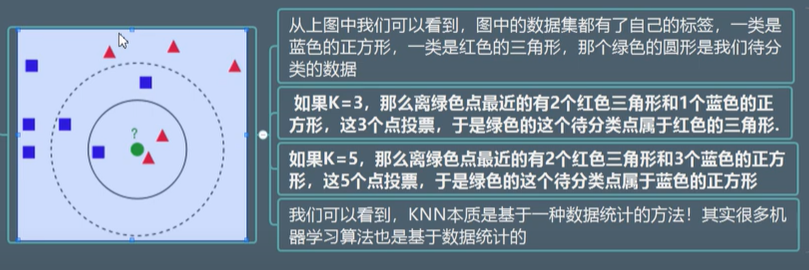
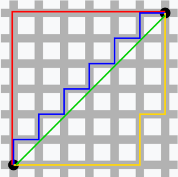

# 知識

### 機器學習分類

- 監督學習

- 無監督學習

- 半監督學習

- 強化學習
 
### KNN (K(個數) nearest neighbor)

 採用測量不同特徵值之間的距離方式，進行分類
 
 - 歐肌理得距離(Euclidean Distance)  
            
            
    

    距離越近，資料越相同。
   
  　空間複雜度與時間複雜度大，因為要批次逐步運算。
  
 　　
   
 `sklearn`: Google出錢給與當時大學生的代碼，已維護十年的函式庫 ，沒有深度學習

－曼哈頓距離(Manhattan distance or Manhattan length)

我們可以定義曼哈頓距離的正式意義為L1-距離或城市區塊距離，

也就是在歐幾里得空間的固定直角坐標系上兩點所形成的線段對軸產生的投影的距離總和。

