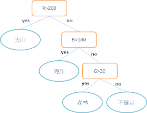

# 知識_決策樹

- 過程直覺單純、執行效率也相當高的監督式機器學習模型，

  適用於分類(classification)及回歸(regression)資料類型的預測，
   
  與其它的ML模型比較起來，執行速度是它的一大優勢。
- 參考  https://scikit-learn.org/stable/modules/tree.html
- 參考 https://chtseng.wordpress.com/2017/02/10/%E6%B1%BA%E7%AD%96%E6%A8%B9-decision-trees/
- 參考 https://www.slideshare.net/XavierYin/ss-62151265
信息論:

概率論:
    貝葉斯

  
  
- Entropy，公式是：
  
  `Entropy = -p * log2 p – q * log2q`

  p：成功的機率（或true的機率） q：失敗的機率（或false的機率）
  
  
  
  

  愈純淨的資料所需要的資訊量愈少，反之愈雜亂的資料需要的資訊量愈多。
  
  Entropy（熵）便應運而生，它是最常用來作為度量資訊量的方法，
  (處理系統複雜度)
  
  當所有的資料都是相同一致，它們的Entropy就是0，
  
  如果資料各有一半不同，那麼Entropy就是１。
  

- 資訊獲利、訊息增益(Information Gain) :

  用目標值分開，

  求原來的熵和分類好的熵，讓他兩個相減。

- 決策樹演算法

  `ID3 (Iterative Dichotomiser 3)`:
  
      a. 1986 年 Ross Quinlan

      b. 該算法創建多路樹，為每個節點（即以貪婪的方式）找到分類特徵，

         該分類特徵將為分類目標產生最大的信息增益。

         將樹長到最大大小，然後通常應用修剪步驟以提高樹概括未見數據的能力。
      
      c. 多叉樹。 
  
  `C4.5`:
  
      a. 1986年 Ross Quinlan
      
      b. 是ID3的後繼版本，並通過動態定義離散屬性（基於數字變量）來消除要素必須分類的限制，
      
         該離散屬性將連續屬性值劃分為離散的間隔集。

         C4.5將訓練後的樹（即ID3算法的輸出）轉換為if-then規則集。 

         然後評估每個規則的這些準確性，以確定應該應用它們的順序。 

         如果沒有規則，規則的準確性會提高，則刪除規則的先決條件即可進行修剪。
      
      c. 使用百分比。
      
      d. 多叉樹。 
  
  `C5.0`:
  
      a. 與C4.5相比，它使用更少的內存並構建更小的規則集，同時更加準確。
      
      b. 多叉樹。 
  
  `CART (Classification and Regression Trees) `:
  
      a. 與C4.5非常相似，但不同之處在於它支持數字目標變量（回歸）並且不計算規則集。 
      
      b. CART使用在每個節點處產生最大信息增益的特徵和閾值構造(只有)二叉樹。 
      
      c. 可分類與回歸。
  
 - 錯誤
 
   `過度訓練(Overfitting)`:因演算法未學習好而發生，導致模式的訓練及測試的錯誤率過高。
   
   `學習不足(Underfitting)`: 樹太小時，騎模型的訓練及測試的錯誤率會變得很大，這樣稱為學習不足。
          
   
