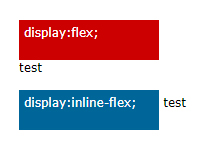

# Flexbox

第一步要來看 Flexbox 的盒子模型，

flex 的盒子模型如下圖所呈現，與一般的盒子模型不同的地方，

在於 Flexbox 的盒子模型具有水平的起點與終點 ( main start、main end )，

垂直的起點與終點 ( cross start、cross end )，水平軸與垂直軸 ( main axis、cross axis )，

然後元素具有水平尺寸與垂直尺寸 ( main size、cross size )，這些都是相當重要的布局規畫。

[W3C_box-model描述](https://www.w3.org/TR/css-flexbox-1/#box-model)

### Flexbox 屬性介紹
 Flexbox的屬性可參考 W3C css3 flexbox css3-flexbox：

    1.display
    
    2.flex-direction
    
    3.justify-content
    
    4.align-items
    
    5.align-self
    
    6.align-content
    
    7.flex-wrap
    
    8.order
    
    9.flex

- display

   display 對於 Flexbox 來說，多了有兩種方式可以設定，預設為「flex」，

   其布局方式與 block 幾乎類似，都會強迫換行，

   但設定display:flex的子元素卻具備了更多彈性的設定。

   另外一種方式則是「inline-flex」，和 inline-block 也是幾乎雷同，

   意義上都是一個display:flex的元素外面包覆display:inline的屬性，在後方的元素不會換行。

 CSS：

      .flex,
      .inline-flex{
          width:100px;
          height:50px;
          border:1px solid #000;
      }
      .flex{
          display:flex;
      }
      .inline-flex{
          display:inline-flex;
      }

  

- flex-direction

   flex-direction 表示 Flexbox 內容元素的「排列方向」，分別有下列四種。

   row：預設值，由左到右，從上到下
   row-reverse：與 row 相反
   column：從上到下，再由左到右
   column-reverse：與 column 相反

CSS：

    .flex-row{
        flex-direction:row;
    }
    .flex-row-reverse{
        flex-direction:row-reverse;
    }
    .flex-column{
        flex-direction:column;
    }
    .flex-column-reverse{
        flex-direction:column-reverse;
    }  
    
      

- justify-content

  justify-content 決定了內容元素與整個 Flexbox 的「水平對齊」位置，
  
  回想一下最上面講的 Flexbox 盒子模型，具有 main start 與 main end 左右兩個端點，
  
  justify-content 就是按照這個方式做設定，而其中的設定值總共有下列五個。

  flex-start：預設值，對齊最左邊的 main start
  
  flex-end：對齊最左邊的 main end
  
  center：水平置中
  
  space-between：平均分配內容元素，左右元素將會與 main start 和 main end 貼齊
  
  space-around：平均分配內容元素，間距也是平均分配
  

CSS：

    .flex-start{
        justify-content:flex-start;
    }
    .flex-end{
        justify-content:flex-end;
    }
    .center{
        justify-content:center;
    }
    .space-between{
        justify-content:space-between;
    }
    .space-around{
        justify-content:space-around;
    }

  

- align-items

align-items 剛好和 justify-content 相反，
align-items 決定了內容元素與整個 Flexbox 的「垂直對齊」位置，
最上面講的 Flexbox 盒子模型，具有 cross start 與 cross end 左右兩個端點，
align-items 與 align-self 就是按照這個方式做設定，
設定值總共有下列五個。

    flex-start：對齊最上面的 cross start
    flex-end：對齊最下面的 cross end
    center：垂直置中
    stretch：預設值，將內容元素全部撐開至 Flexbox 的高度
    baseline：以所有內容元素的基線作為對齊標準

CSS：

    .flex-start{
        align-items:flex-start;
    }
    .flex-end{
        align-items:flex-end;
    }
    .center{
        align-items:center;
    }
    .stretch{
        align-items:stretch;
    }
    .baseline{
        align-items:baseline;
    }
    .flex-item{
        width:60px;
        text-align:center;
    }
    .item1{
        font-size:20px;
        line-height: 60px;
        background:#c00;
    }
    .item2{
        line-height: 30px;
        background:#095;
    }
    .item3{
        font-size:30px;
        line-height: 100px;
        background:#059;
    }

- align-self

  align-self 的設定與 align-items 相同，

  但目的不同，align-self 的作用在於覆寫已經套用 align-items 的屬性，

  如果照我們以前所寫，因為 align-items 是針對子元素，

  所以必須要用 align-self 來進行覆寫，我們直接用上一個範例來修改就很清楚了。

CSS：

    .item2{
        align-self:baseline;
        line-height: 30px;
        background:#095;
    }

  

- align-content

剛剛談到的 align-items 是針對內容為單行的元素進行處理，

如果遇到多行的元素，就要使用 align-content 這個屬性，這個屬性總共有六個設定值。

    flex-start：對齊最上面的 cross start
    flex-end：對齊最下面的 cross end
    center：垂直置中
    space-between：將第一行與最後一行分別對齊最上方與最下方
    space-around：每行平均分配間距
    stretch：預設值，內容元素全部撐開
    
CSS：

    .flex-start,
    .flex-end,
    .center,
    .space-between,    
    .space-around,    
    .stretch{
        display:inline-flex;
        flex-wrap:wrap;
        width:180px;
        height:160px;
        margin:5px 5px 40px;
        border:1px solid #000;
        vertical-align: top;
    }
    .flex-start{
        align-content:flex-start;
    }
    .flex-end{
        align-content:flex-end;
    }
    .center{
        align-content:center;
    }
    .space-between{
        align-content:space-between;
    }
    .space-around{
        align-content:space-around;
    }
    .stretch{
        align-content:stretch;
    }
    .align-content>div{
        padding:15px;
        margin:2px;
        background:#666;
    }
    
 

- flex-wrap

在剛剛的範例看到一個 flex-wrap 的屬性，這個屬性負責的是讓內容的元素換行，

因為當我們把父元素的 display 設定為 flex 或 inline-flex 的時候，

子元素就是以單行的方式，彈性撐滿父元素，所以就要利用 flex-wrap 來換行，共有三個設定值。

    nowrap：預設值，單行
    wrap：多行
    wrap-reverse：多行，但內容元素反轉

CSS：

    .nowrap,
    .wrap,
    .wrap-reverse{
        display:inline-flex;
        flex-wrap:wrap;
        width:180px;
        height:80px;
        margin:5px 5px 40px;
        border:1px solid #000;
        vertical-align: top;
    }
    .column{
        flex-direction:column;
        width:120px;
        height:180px;
    }
    .nowrap{
        flex-wrap:nowrap;
    }
    .wrap{
        flex-wrap:wrap;
    }
    .wrap-reverse{
        flex-wrap:wrap-reverse;
    }
    .align-content div{
        width:30px;
        height:30px;
        margin:5px;
        background:#069;
    }
    .column div{
        background:#f50;
    }
    
     

- order

剛剛在 flex-wrap 的屬性裏頭看到了可以把元素反轉，

order 這個屬性更是可以直接指定一個數字，

就可以由小到大的排列順序。

     .item{
         width:50px;
         height:60px;
         text-align: center;
         line-height: 50px;
     }
     .order1{
         order:1;
         background:#c00;
     }
     .order2{
         order:2;
         background:#069;
     }
     .order3{
         order:3;
         background:#095;
     }
     .order4{
         order:4;
         background:#f50;
     }
     .order5{
         order:5;
         background:#777;
     }
     .order6{
         order:6;
         background:#077;
     }
     
     
     

